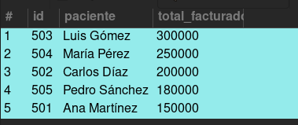

# Solución Taller #4 Consultas, Vistas, Procedimientos y Trigger

Resumen sin imagenes en [README.md](./README.md)

## Primera actividad

En el commit 0639935
modifico el script generador de la librería para que acepte números de ISBN de 13 digitos, ya que el standard se actualizó desde 2008: [about ISBN](https://www.isbn.org/about_ISBN_standard)

Script de poblado de la base de datos: [libreria_populate.sql](./libreria_populate.sql)

5 Consultas a la librería: [libreria_queries.sql](./libreria_queries.sql)

1. El nombre y la fecha de nacimiento de cada escritor

```sql
SELECT
    nombre AS autor, `fecha de nacimiento`
FROM
    autor;
```


2. La cantidad de libros diferentes vendidos

Interpretandolo como que se quiere conocer las ventas de los libros:

```sql
SELECT
    l.ISBN,
    l.titulo,
    l.numero_paginas,
    l.nombre_editorial,
    c.nombre AS `comprado_por`
FROM
    libro_cliente AS lc
        LEFT JOIN
    libro AS l ON ISBN_libro_cliente = ISBN
        LEFT JOIN
    cliente AS c ON id_cliente = cedula;
```


Interpretandolo como el número de veces que se ha vendido cada libro:

```sql
SELECT
    l.ISBN, l.titulo, COUNT(l.ISBN) AS `ejemplares_vendidos`
FROM
    libro_cliente AS lc
        LEFT JOIN
    libro AS l ON ISBN_libro_cliente = ISBN
GROUP BY l.ISBN;
```


3. El nombre de su cliente acompañado de sus numeros teléfonicos

```sql
SELECT
    c.nombre, t.numero
FROM
    cliente AS c
        LEFT JOIN
    telefono_cliente AS t ON c.cedula = t.cedula_cliente;
```


4. El nombre del libro acompañado por su autor o sus autores

```sql
SELECT
    l.ISBN,
    l.titulo,
    l.numero_paginas,
    l.nombre_editorial,
    a.nombre AS autor
FROM
    libro AS l
        LEFT JOIN
    libro_autor AS la ON LA.ISBN_libro = l.ISBN
        LEFT JOIN
    autor AS a ON la.id_autor = a.id;
```


5. El nombre de las editoriales que han logrado vender libros.

```sql
SELECT
    nombre_editorial, COUNT(ISBN) AS `Libros_vendidos`
FROM
    libro_cliente
        LEFT JOIN
    libro ON ISBN_libro_cliente = ISBN
GROUP BY nombre_editorial;
```


### Vistas realizadas:

Las 2 vistas más relevantes para obtener de esta base de datos son las que otorgan información sobre el negocio, facilitando la toma de desiciónes. Por lo tanto realicé vistas que muestran información relacionada con las ventas y los clientes.

- Libros más vendidos en orden

```sql
CREATE VIEW libros_vendidos AS
    SELECT
        l.*, COUNT(l.ISBN) AS `cantidad_vendidos`
    FROM
        libro_cliente AS lc
            LEFT JOIN
        libro AS l ON lc.ISBN_libro_cliente = l.ISBN
    GROUP BY l.ISBN
    ORDER BY cantidad_vendidos DESC;

SELECT * FROM libros_vendidos;
```


- Clientes que más libros compraron en orden

```sql
CREATE VIEW clientes_frequentes AS
    SELECT
        c.*, COUNT(lc.ISBN_libro_cliente) AS `cantidad_comprados`
    FROM
        libro_cliente AS lc
            LEFT JOIN
        cliente AS c ON lc.id_cliente = c.cedula
    GROUP BY c.cedula
    ORDER BY cantidad_comprados DESC;

SELECT * FROM clientes_frequentes;
```


Archivo [libreria_views.sql](./libreria_views.sql)

## Segunda actividad

De acuerdo al modelo relacional del hospital, realizo la definición de la base de datos en sql: [hospital_schema.sql](./hospital_schema.sql)

Script de poblado de la db hospital: [hospital_populate.sql](./hospital_populate.sql)

Consultas a la db del hospital: [hospital_queries.sql](./hospital_queries.sql)

1. Que medicamentos a tomado cada paciente y la dosis suministrada.

```sql
SELECT
    p.id AS `id_paciente`,
    p.nombres,
    p.apellidos,
    m.id AS `id_medicamento`,
    m.nombre AS `medicamento`,
    m.dosis
FROM
    paciente_medicamento pm
        LEFT JOIN
    Pacientes AS p ON pm.id_paciente = p.id
        LEFT JOIN
    Medicamentos AS m ON pm.id_medicamento = m.id;
```


2. Que enfermeros estuvieron en los procedimientos de los pacientes.

```sql
SELECT
    p.id AS `id_paciente`,
    p.nombres,
    p.apellidos,
    p.id_procedimiento,
    pro.tipo AS `procedimiento`,
    e.id AS `id_enfermero`,
    CONCAT(e.nombres, e.apellidos) AS `enfermero`
FROM
    Pacientes AS p
        LEFT JOIN
    Procedimientos AS pro ON p.id_procedimiento = pro.id
        LEFT JOIN
    medico_procedimiento AS mp ON pro.id = mp.id_procedimiento
        LEFT JOIN
    Enfermeros AS e ON mp.id_medico = e.id_medico;
```


### Vistas realizadas:

Archivo [hispital_views.sql](./hispital_views.sql)

Las 3 vistas más relevantes que escogí son las que permiten identificar información crítica para el funcionamiento del hospital, tales como:

- Los medicamentos más demandados en orden

```sql
CREATE VIEW medicamentos_prioritarios AS
    SELECT
        m.id, m.nombre, m.dosis, COUNT(m.id) AS `dosis_usadas`
    FROM
        Medicamentos m
            JOIN
        paciente_medicamento pm ON m.id = pm.id_medicamento
    GROUP BY m.id
    ORDER BY dosis_usadas DESC;

SELECT * FROM medicamentos_prioritarios;
```


- Los pacientes que más valor han facturado en orden

```sql
CREATE VIEW pacientes_frecuentes AS
    SELECT
        p.id,
        CONCAT(p.nombres, ' ', p.apellidos) AS `paciente`,
        SUM(f.valor_total) AS `total_facturado`
    FROM
        Facturas f
            LEFT JOIN
        Pacientes p ON f.id_paciente = p.id
    GROUP BY p.id
    ORDER BY total_facturado DESC;

SELECT * FROM pacientes_frecuentes;
```



- Los médicos que más procedimientos diferentes pueden realizar.

```sql
CREATE VIEW top_medicos AS
    SELECT
        m.*, COUNT(mp.id_procedimiento) AS `cantidad_procedimientos`
    FROM
        medico_procedimiento mp
            LEFT JOIN
        Medicos m ON mp.id_medico = m.id
    GROUP BY mp.id_medico
    ORDER BY cantidad_procedimientos DESC;

SELECT * FROM top_medicos;
```


finalmente agregué una vista general de todos los procedimientos, relacionando los pacientes, médicos y la cantidad de enfermeros involucrados.

```sql
CREATE VIEW procedimientos_completo AS
    SELECT
        pro.id,
        pro.tipo AS `procedimiento`,
        p.id AS `id_paciente`,
        CONCAT(p.nombres, ' ', p.apellidos) AS `paciente`,
        m.id AS `id_medico`,
        CONCAT(m.nombres, ' ', m.apellidos) AS `medico`,
        COUNT(e.id) AS `cantidad_enfermeros`
    FROM
        Procedimientos pro
            LEFT JOIN
        Pacientes p ON pro.id = p.id_procedimiento
            LEFT JOIN
        medico_procedimiento mp ON pro.id = mp.id_procedimiento
            LEFT JOIN
        Medicos m ON mp.id_medico = m.id
            LEFT JOIN
        Enfermeros e ON mp.id_medico = e.id_medico
    GROUP BY pro.id , p.id , m.id;

SELECT * FROM procedimientos_completo;
```


## Tercera actividad

### Stored procedures

> Para los procedures establezco el delimitador como `DELIMITER $$`

Creo los stored procedures para realizar operaciones crud en las db de la librería y el hospital incluyendo ejemplos de su uso con comentarios:

- [libreria_procedures.sql](./libreria_procedures.sql)

```sql
-- Crear nuevo libro con autor ya registrado y relacionarlos
CREATE PROCEDURE crear_libro_con_un_actor (
		IN isbn VARCHAR(13),
		IN titulo VARCHAR(45),
		IN num_paginas VARCHAR(45),
		IN nombre_editorial VARCHAR(50),
		IN id_autor VARCHAR(10)
    )
BEGIN
	INSERT INTO libro VALUES (isbn, titulo, num_paginas, nombre_editorial);
	INSERT INTO libro_autor VALUES (isbn, id_autor);
END$$

-- CALL crear_libro_con_un_actor('9780061122123', 'Libro de prueba', 429, 'HarperCollins', '2345678901')$$
```


```sql
-- Consultar todos los detalles relacionados a un libro
CREATE PROCEDURE libro_detalles (
		IN isbn VARCHAR(13)
    )
BEGIN
	SELECT
		l.*,
        e.Telefono as "telefono_editorial",
        a.id as "id_autor",
        a.nombre as "autor",
        a.nacionalidad
	FROM (
		SELECT *
		FROM libro l
		WHERE l.ISBN = isbn
	) AS l
	LEFT JOIN libro_autor la ON l.ISBN = la.ISBN_libro
	LEFT JOIN autor a ON la.id_autor = a.id
    LEFT JOIN Editorial e ON l.nombre_editorial = e.nombre;
END$$

-- CALL libro_detalles('9780061122123')$$
```


```sql
-- Actualizar el titulo de un libro
CREATE PROCEDURE actualizar_libro_titulo (
		IN isbn VARCHAR(13),
        IN titulo VARCHAR(45)
	)
BEGIN
	UPDATE libro l SET l.titulo = titulo WHERE l.ISBN = isbn;
END$$

-- CALL actualizar_libro_titulo('9780061122123', 'Libro de prueba 2')$$
```


```sql
-- Actualizar agregando autor existente a libro existente
CREATE PROCEDURE agregar_libro_autor (
		IN isbn VARCHAR(13),
		IN id_autor VARCHAR(10)
    )
BEGIN
	INSERT INTO libro_autor VALUES (isbn, id_autor);
END$$

-- CALL agregar_libro_autor('9780061122123', '1234567890')$$
```


```sql
-- Eliminar libro con sus relaciones de autores
CREATE PROCEDURE eliminar_libro (
		IN isbn VARCHAR(13)
    )
BEGIN
	DELETE FROM libro_autor la WHERE la.ISBN_libro = isbn;
    DELETE FROM libro l WHERE l.ISBN = isbn;
END$$
```


- [hospital_procedures.sql](./hospital_procedures.sql)

```sql
-- Consultar todos los detalles relacionados a un medico
CREATE PROCEDURE enfermero_detalles (
		IN id INT
    )
BEGIN
	SELECT
		e.*,
        CONCAT( m.nombres, " ", m.apellidos) AS `medico`,
        m.especialidad
	FROM (
		SELECT *
		FROM Enfermeros e
		WHERE e.id = id
	) AS e
	LEFT JOIN Medicos m ON e.id_medico = m.id;
END$$
-- CALL enfermero_detalles(403);
```


```sql
-- Crear nuevo enfermero y relacionarlo con un nuevo num de telefono
CREATE PROCEDURE crear_enfermero_con_telefono (
		IN id int,
		IN nombres VARCHAR(50),
        IN apellidos VARCHAR(50),
        IN id_medico INT,
		IN telefono VARCHAR(20)
    )
BEGIN
	INSERT INTO Enfermeros VALUES (id, nombres, apellidos, id_medico);
	INSERT INTO telefonos_enfermero VALUES (id, telefono);
END$$

-- CALL crear_enfermero_con_telefono(409, 'Pepito', 'Perez', 102, '3102812040');
```


```sql
-- Reasignar enfermero a otro medico
CREATE PROCEDURE reasignar_enfermero (
		IN id INT,
        IN id_medico INT
	)
BEGIN
	UPDATE Enfermeros e SET e.id_medico = id_medico WHERE e.id = id;
END$$

-- CALL reasignar_enfermero(409, 104);
```


```sql
-- Eliminar enfermero y sus telefonos relacionados
CREATE PROCEDURE eliminar_enfermero (
		IN id INT
    )
BEGIN
	DELETE FROM telefonos_enfermero te WHERE te.id_enfermero = id;
    DELETE FROM Enfermeros e WHERE e.id = id;
END$$
-- CALL eliminar_enfermero(409);
```


### Triggers

Creo las tablas `control_de_cambios_librería`, `control_de_cambios_hospital` y los triggers para llenarlas cuando se inserta o se borra una registro:

```sql
CREATE TABLE IF NOT EXISTS control_de_cambios_librería (
    usuario VARCHAR(50),
    accion VARCHAR(255),
    fecha_hora TIMESTAMP
)  ENGINE=INNODB;

CREATE TABLE if not exists control_de_cambios_hospital (
    usuario VARCHAR(50),
    accion VARCHAR(255),
    fecha_hora TIMESTAMP
)  ENGINE=INNODB;
```

- [libreria_triggers.sql](./libreria_triggers.sql)

```sql
CREATE TRIGGER  insert_logger
 AFTER INSERT ON libro FOR EACH ROW
    INSERT INTO control_de_cambios_librería VALUES (
		CURRENT_USER(),
        CONCAT('nuevo registro; ', NEW.ISBN, ", ", NEW.titulo, ", ", NEW.numero_paginas, ", ", NEW.nombre_editorial),
        NOW()
	);

CREATE TRIGGER  delete_logger
 AFTER delete ON libro FOR EACH ROW
    INSERT INTO control_de_cambios_librería VALUES (
		CURRENT_USER(),
        CONCAT('registro borrado; ', OLD.ISBN, ", ", OLD.titulo, ", ", OLD.numero_paginas, ", ", OLD.nombre_editorial),
        NOW()
	);
-- SELECT * FROM libro;
-- INSERT INTO libro VALUES ('123','Libro de preubaa',123,'HarperCollins');
-- DELETE FROM libro l WHERE l.ISBN = "123";
-- SELECT * FROM libro;
-- SELECT * FROM control_de_cambios_librería;
```

- [hospital_triggers.sql](./hospital_triggers.sql)

```sql
CREATE TRIGGER insert_logger
 AFTER INSERT ON Enfermeros FOR EACH ROW
    INSERT INTO control_de_cambios_hospital VALUES (
		CURRENT_USER(),
        CONCAT('nuevo registro; ', NEW.id, ", ", NEW.nombres, ", ", NEW.apellidos, ", ", NEW.id_medico),
        NOW()
	);

CREATE TRIGGER delete_logger
 AFTER delete ON Enfermeros FOR EACH ROW
    INSERT INTO control_de_cambios_hospital VALUES (
		CURRENT_USER(),
        CONCAT('registro borrado; ', OLD.id, ", ", OLD.nombres, ", ", OLD.apellidos, ", ", OLD.id_medico),
        NOW()
	);

-- INSERT INTO Enfermeros VALUES (409, 'Pepito', 'Perez', 102);
-- DELETE FROM Enfermeros e WHERE e.id= 409;
-- SELECT * FROM control_de_cambios_hospital;
```


## Mejoras al modelo

Solicitando la descripción de cuáles son las reglas del negocio se puede analizar a profundidad el diseño del modelo, sin embargo a simple vista realizo las siguientes sugerencias:

- A un paciente le pueden realizar **varios** procedimientos en lugar de uno solo
- Un procedimiento debe ser realizado por **mínimo un** medico (participación total)
- Ya que los medicamentos tienen un identificador y se relaciona con muchos pacientes, me parece que la relación paciente **solicitar** medicamentos sería más adecuado que "tomar" en el contexto del hospital.
- Medicamentos podría tener un atributo de `cantidad` o "stock".
- Agregar la relación de muchos a muchos **incluir** entre factura y procedimientos con participación total del lado de factura.
- Procedimiento puede tener el atributo `precio`
